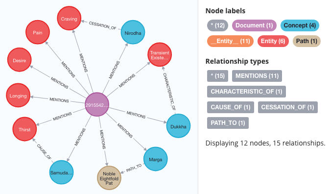

# Extracting (some) Knowledge Graph out of a tiny text<!-- omit from toc -->

## Table of contents<!-- omit from toc -->

- [Introduction](#introduction)
- [Running the full default data workflow](#running-the-full-default-data-workflow)

## Introduction

This repository holds a very brief snippet of text (less than ten sentences), known in Buddhism as the ["Four Noble Truths"](https://en.wikipedia.org/wiki/Four_Noble_Truths), to be used as input to test various knowledge graph extraction data workflows.
Because we expect quite reduced execution runtime for the workflows (and thus speed up development) the only researched feature of the considered text is its brevity.

The [chosen english version of the Four Noble Truths](250_BCE_-_Dhammacakkappavattana_Sutta_Four_Noble_Truths_Wikipedia_translation.md) was extracted from [Wikipedia's "Four Noble Truths" article](https://en.wikipedia.org/wiki/Four_Noble_Truths).



## Running the full default data workflow

### Setup: fetch workflow utilities

```bash
cd `git rev-parse --show-toplevel`         # Implicit from now on
git clone https://github.com/EricBoix/jj_worflow_shell.git jj_shell_utils
```

### Context cleanup: BE SURE NOT TO MISS THIS STAGE

Remove any previous database content.

**WARNING**: the username/password given to the neo4j database are only **initial** values (valid when starting the database for the first time). Once the neo4j db has been initialized those values are "burned" into the `database` files...

```bash
export RESULTS_DIR=`pwd`/result_data       # Syntactic sugar
\rm -fr result_data/database
```

### Configuring things

Change the following neo4j database parameter values in order to suit your needs

```bash
export NEO4J_PORT=7687
export NEO4J_USERNAME=neo4j
export NEO4J_PASSWORD=your_password
```

The also adapt the following LLM server designation and credentials

```bash
LLM_MODEL_URL=https://ollama-ui.pagoda.liris.cnrs.fr/ollama/
LLM_API_KEY=sk-xxxxxxxxxxxxxxxxxxxxxxxxxxxxxxx
LLM_MODEL_NAME=llama3:70b
```

Transmitting (by file) servers info to upcoming treatment processes:

```bash
echo "# Neo4j server designation and associated credentials" > .env
echo "NEO4J_URI=bolt://localhost:$NEO4J_PORT"                >> .env
echo "NEO4J_USERNAME=$NEO4J_USERNAME"                        >> .env
echo "NEO4J_PASSWORD=$NEO4J_PASSWORD"                        >> .env
#
echo "### LLM server designation and associate credential" >> .env
echo "MODEL_URL=$LLM_MODEL_URL"                            >> .env
echo "API_KEY=$LLM_API_KEY"                                >> .env
echo "MODEL=$LLM_MODEL_NAME"                               >> .env
```

### Creating extraction workflow context: launch a neo4j database

```bash
source jj_shell_utils/Neo4jDatabase.sh    # Implicit from now on
launch_neo4j_db $RESULTS_DIR $NEO4J_PORT $NEO4J_USERNAME/$NEO4J_PASSWORD
```

### Run the (Knowledge Graph) extraction

```bash
source jj_shell_utils/treatments.sh   # Implicit from now on
# Note: the documents are implicitly in <cwd>/original_data sub-directory
extract_knowledge_graph `pwd`/original_data '--load_markdown_document 250_BCE_-_Dhammacakkappavattana_Sutta_Four_Noble_Truths_Wikipedia_translation.md' 
```

### Dump the database content for later usage (optional)

```bash
dump_database $RESULTS_DIR neo4j.Four-Noble-Truths-Wikipedia-translation.Markdown.dump
```

In order to validate the dump, erase the database and restore it (out of the
previous dump)...

```bash
# WARNING: this DELETEs the existing database
rm -fr $RESULTS_DIR/database     
restore_database $RESULTS_DIR neo4j.Four-Noble-Truths-Wikipedia-translation.Markdown.dump
launch_neo4j_db $RESULTS_DIR $NEO4J_PORT $NEO4J_USERNAME/$NEO4J_PASSWORD
```

### Extract knowledge graph

Note: the KG file uses the [Turtle](https://en.wikipedia.org/wiki/Turtle_(syntax)) format.

```bash
dump_knowledge_graph_in_turtle $RESULTS_DIR Four-Noble-Truths-Wikipedia-translation-Markdown.ttl
```

Eventually turn the context off:

```bash
stop_neo4j_db
```
